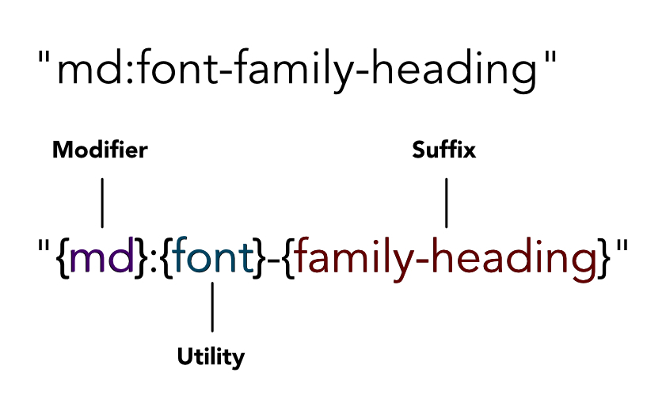

import { Canvas, Meta, Story } from '@storybook/addon-docs';
import { CATEGORIES } from "../../storybook/constants"
import BespokeComponent from './tailwind-bespoke-component.png';

<Meta title={`${CATEGORIES.tailwind}/Docs/README`} />

# Install

```
yarn add -D @kaizen/tailwind
```

## Table of contents

- [Caveat before use](#caveat-before-use)
- [What our package does](#what-our-package-does)
- [Getting started](#getting-started)
- [Use cases](#use-cases)
  - [1. Spacing and layouts](#1-spacing-and-layouts)
  - [2. Creating bespoke components](#2-creating-bespoke-components)
  - [3. Altering Kaizen components with classnameOverride](#3-altering-kaizen-components-with-classnameoverride)

## Caveat before use

This is an early release of the Kaizen Tailwind Preset - the API may change and evolve as we receive feedback from our teams. We will endeavour to assist where possible if classes or utilities are updated in the future.


## What our package does

This package is essentially a custom Tailwind preset. This package does not change how Tailwind works; it only changes the suffixes that can be attached to utilities.

  

These suffixes are based on our [design tokens](https://github.com/cultureamp/kaizen-design-system/tree/main/packages/design-tokens).

For this reason, refer to the [Tailwind core concepts docs](https://tailwindcss.com/docs/utility-first) for getting up to speed on how Tailwind _works_, but refer to our [storybook](https://cultureamp.design/storybook/) as a reference guide for our _custom suffixes_.

As an example, if I wanted to know which font-family values are available as Tailwind classes, I would open our storybook and look under Tailwind > Typography > Font Family (or just search "Font Family").

## Getting started

>The assumption is that you have previously followed the FE Foundation guide for setting Tailwind up in your project.

Install `@kaizen/tailwind` as a dependency and require it into your Tailwind config. Then, pass it into your `presets` array.

```js
// this originally lived in @kaizen/design-tokens but we've decoupled this for ease of versioning
const { Preset } = require("@kaizen/tailwind")

module.exports = {
  content: ["./**/*.{ts,tsx}"],
  presets: [Preset],
  // important to add to the #root and #docs-root (for storybook) to ensure that Tailwind classes supersede component styles
  important: ["#root", "#docs-root"],
  theme: {
    extend: {},
  },
  plugins: [],
}
```

For preset configuration options, see [CONFIGURATION.md](CONFIGURATION.md)

## Use cases

### 1. Spacing and layouts
Ideally, minimal styling should be applied to KZ components, with spacing between components handled by the consumer via TW classes. This package provides all of Kaizen's spacing tokens as TW css classes, making this process quick and easy.  
As a simple example, here one of our spacing tokens is being used to add a right margin to a `Button` component, without the need for a css file.
```js
<div className="mr-4">
  <Button label="Button 1" />
</div>
<Button label="Button 2" />
```

### 2. Creating bespoke components
Occasionally snowflakes need to be created. This package provides common utilities based on our design tokens, such as color, border-radius, and font-family. Ideally, as much styling of bespoke components should be handled with Tailwind, but keep in mind that scss can still be used when necessary.

Here is an example of our TW package being used to create a bespoke, non-Kaizen component:
```js
<div className="w-[200px] rounded-default border-solid border-blue-500 bg-blue-100 text-blue-500">
  <p className="m-0 p-12 pl-16 font-family-paragraph">Label</p>
</div>
```


### 3. Altering Kaizen components with classnameOverride
If a Kaizen component supports `classNameOverride`, Tailwind classes can also be used.  
In this example, a Tailwind css rule is being applied to a Kaizen component to ensure that the first letter is capitalized.

```js
<Heading variant="heading-1" classNameOverride="first-letter:capitalize">
  {props.heading}
</Heading>
```
