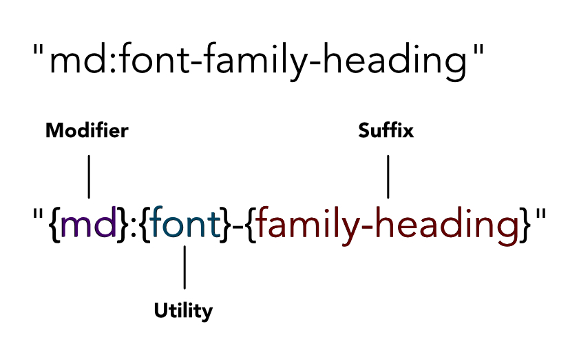

# Install

```
yarn add -D @kaizen/tailwind
```

## Table of contents

- [Caveat before use](#caveat-before-use)
- [What our package does](#what-our-package-does)
- [Getting started](#getting-started)

## Caveat before use

This is an early release of the Kaizen Tailwind Preset - the API may change and evolve as we receive feedback from our teams. We will endeavour to assist where possible if classes or utilities are updated in the future.


## What our package does

This package is essentially a custom Tailwind preset. This package does not change how Tailwind works; it only changes the suffixes that can be attached to utilities.

  

These suffixes are based on our [design tokens](https://github.com/cultureamp/kaizen-design-system/tree/main/packages/design-tokens).

For this reason, refer to the [Tailwind core concepts docs](https://tailwindcss.com/docs/utility-first) for getting up to speed on how Tailwind _works_, but refer to our [storybook](https://cultureamp.design/storybook/) as a reference guide for our _custom suffixes_.

As an example, if I wanted to know which font-family values are available as Tailwind classes, I would open our storybook and look under Tailwind > Typography > Font Family (or just search "Font Family").

## Getting started

>The assumption is that you have previously followed the FE Foundation guide for setting Tailwind up in your project.

Install `@kaizen/tailwind` as a dependency and require it into your Tailwind config. Then, pass it into your `presets` array.

```js
// this originally lived in @kaizen/design-tokens but we've decoupled this for ease of versioning
const { Preset } = require("@kaizen/tailwind")

module.exports = {
  content: ["./**/*.{ts,tsx}"],
  presets: [Preset],
  // important to add to the #root and #docs-root (for storybook) to ensure that Tailwind classes supersede component styles
  important: ["#root", "#docs-root"],
  theme: {
    extend: {},
  },
  plugins: [],
}
```

For preset configuration options, see [CONFIGURATION.md](CONFIGURATION.md)

